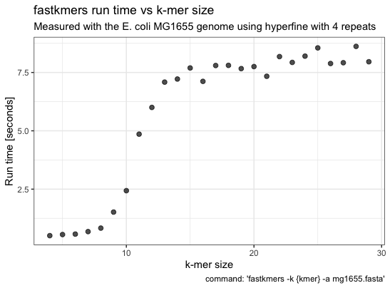

[](https://github.com/angelovangel/fastkmers/actions/workflows/rust.yml)

# fastkmers

A simple program for getting k-mer counts from a fastq/fasta file, written in Rust.

## Description

This command line program takes a fastq/fasta file as input and outputs the counts of [k-mers](https://en.wikipedia.org/wiki/K-mer) of a specified length. It is implemented using hash tables and a simple algortihm but is still reasonably fast. The maximum supported k-mer size is 31.

## Install

I provide precompiled binaries for linux only [here](https://github.com/angelovangel/fastkmers/releases/download/v0.1.2/fastkmers), but it is simple to compile and run:

```bash
curl --proto '=https' --tlsv1.2 -sSf https://sh.rustup.rs | sh
git clone https://github.com/angelovangel/fastkmers.git

cd fastkmers
cargo build --release

```

The executable file `fastkmers` is now under `./target/release/`
## Usage


```bash
# Make sure the executable is in your path
# check available options

fastkmers -h

# to get 4-mer counts and a summary
fastkmers -k 4 -s file.fastq.gz

# output json, input fasta
fastkmers -k 4 -a -j file.fasta

# query for a specific k-mer
fastkmers -k 5 -q "AATTG" file.fastq.gz

# query with regex is also supported
# this example would match all 5-mers whose last 4 bases are: not T| A | T or G | A
fastkmers -k 5 -q "[^T]A[T|G]A$" file.fastq.gz

```

The k-mer counts are printed to `stdout` as a tab-separated table or as `json`.

## Speed

I haven't compared to other programs (e.g. `jellyfish`), below are some measurements of the execution times for different k-mer sizes of the E. coli MG1655 genome, performed on a MacBook Pro 2018 (Intel i5 and 8 Gb RAM).

```bash
hyperfine -r 4 --warmup 1 --export-csv hyperfine-kmer-size.csv -P kmer 4 29 'fastkmers -k {kmer} -a mg1655.fasta'
```


